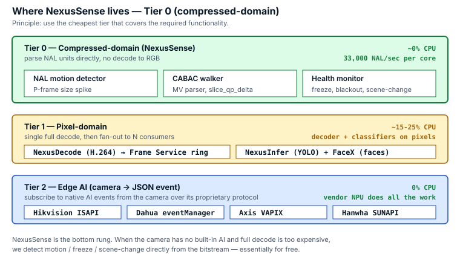
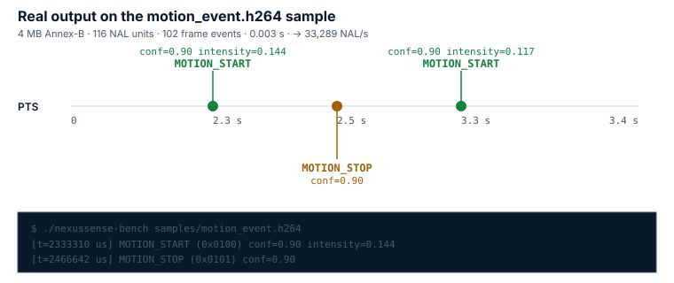

# NexusSense

> Bitstream Intelligence Engine. **Compressed-domain analytics** на H.264/H.265 — motion / health / scene detection прямо из NAL units, без декода в RGB. **56 KB**, **33 000 NAL/s** на одно ядро, ~0% CPU.

[](#)
[](#)
[](#)
[](#)
[](#)

NexusSense парсит структуру H.264/H.265 битстрима и извлекает события **без декодирования в пиксели**. Для NVR с десятками камер это означает: motion detection, freeze/blackout/scene-change alerts работают за «бесплатно» относительно полного декод-pipeline'а.

Часть стека [NexusEye](https://github.com/facex-engine).

---

## Где живёт NexusSense в архитектуре



NexusSense — это **ярус 0**. Когда у камеры нет встроенного AI на NPU (ярус 2 — Hikvision/Dahua/Axis edge events), и pixel-domain CV (ярус 1) — слишком дорого для вашей нагрузки, NexusSense ловит мотив прямо из bitstream'а.

## Как выглядит реальный output



```
$ ./nexussense-bench samples/motion_event.h264
nexussense-bench · file=samples/motion_event.h264 · size=4.02 MB
  [t=2333310 us] MOTION_START (0x0100)  conf=0.90  intensity=0.144
  [t=2466642 us] MOTION_STOP  (0x0101)  conf=0.90
  [t=3266634 us] MOTION_START (0x0100)  conf=0.90  intensity=0.117

Processed: 116 NAL units (102 frame events)  in 0.003 s = 33 289 NAL/s
Events emitted:
  motion_start: 2
  motion_stop:  1
```

---

## Что умеет

| Модуль          | Флаг              | Что детектирует                                       |
|-----------------|-------------------|-------------------------------------------------------|
| Motion          | `BIE_MOD_MOTION`  | size-spike детектор по P-кадрам, EWMA-baseline        |
| Tracker         | `BIE_MOD_TRACKER` | объект-трекинг по motion vectors (CABAC walker)       |
| Health          | `BIE_MOD_HEALTH`  | freeze · blackout · whiteout · scene-change · framedrop |
| Forensic        | `BIE_MOD_FORENSIC`| double-compression, GOP breaks, SPS changes           |
| Scene           | `BIE_MOD_SCENE`   | indoor/outdoor · day/night · activity level           |
| Privacy         | `BIE_MOD_PRIVACY` | DCT-domain redaction (без полного re-encode)          |

Все модули включаются битмаской на `bie_stream_open()`, можно держать только нужные.

---

## API

```c
#include "bie.h"

/* 1. Инициализация */
bie_config_t cfg = bie_config_default();
bie_engine_t* eng = bie_create(&cfg);

bie_set_callback(eng, on_event, /* user_data */ NULL);

/* 2. Открываем stream (один engine может держать N streams от разных камер) */
int modules = BIE_MOD_MOTION | BIE_MOD_HEALTH | BIE_MOD_SCENE;
bie_stream_t* str = bie_stream_open(eng, "cam-225", BIE_CODEC_H264, modules);

/* 3. Кормим NAL unit'ами по мере их появления */
while (read_nal(rtsp_session, nal_data, &nal_len)) {
    int r = bie_process_nalu(str, nal_data, nal_len, pts_us);
    if (r > 0) bie_run_modules(eng, str);    /* запустить аналитику на frame */
}

/* 4. Cleanup */
bie_stream_close(eng, str);
bie_destroy(eng);

/* Callback */
void on_event(bie_event_t* ev, void* user) {
    if (ev->type == BIE_EV_MOTION_START)
        printf("motion! intensity=%.2f conf=%.2f\n",
               ev->data.motion.intensity, ev->confidence);
}
```

---

## События

```c
typedef enum {
    /* Motion */
    BIE_EV_MOTION_START     = 0x0100,
    BIE_EV_MOTION_STOP      = 0x0101,
    BIE_EV_MOTION_LEVEL     = 0x0102,   /* periodic intensity update */

    /* Object tracker */
    BIE_EV_TRACK_NEW        = 0x0200,
    BIE_EV_TRACK_UPDATE     = 0x0201,
    BIE_EV_TRACK_LOST       = 0x0202,
    BIE_EV_TRACK_LINE_CROSS = 0x0203,

    /* Camera health */
    BIE_EV_HEALTH_BLACKOUT  = 0x0300,
    BIE_EV_HEALTH_WHITEOUT  = 0x0301,
    BIE_EV_HEALTH_FREEZE    = 0x0302,
    BIE_EV_HEALTH_BLUR      = 0x0303,
    BIE_EV_HEALTH_SCENE_CHG = 0x0304,
    BIE_EV_HEALTH_BITRATE   = 0x0305,
    BIE_EV_HEALTH_FRAMEDROP = 0x0306,
    BIE_EV_HEALTH_DEAD      = 0x0307,
    BIE_EV_HEALTH_RECOVER   = 0x0308,

    /* Forensic */
    BIE_EV_FORENSIC_DOUBLE_COMPRESS = 0x0400,
    BIE_EV_FORENSIC_FRAME_GAP       = 0x0401,
    BIE_EV_FORENSIC_GOP_BREAK       = 0x0402,
    BIE_EV_FORENSIC_SPS_CHANGE      = 0x0403,

    /* Scene */
    BIE_EV_SCENE_CLASS              = 0x0500,
} bie_event_type_t;
```

Каждое событие несёт `confidence` (0.0–1.0), `timestamp_us` и type-specific payload (intensity для motion, baseline+metric для health, и т.д.).

---

## Конфигурация чувствительности

```c
typedef struct {
    float motion_threshold_k;        /* default 3.0  — sigma multiplier */
    float motion_ewma_alpha;         /* default 0.02 — adaptation rate */
    int   motion_min_frames;         /* default 3    — warm-up frames */
    int   health_freeze_frames;      /* default 30   — freeze alert delay */
    float health_blackout_ratio;     /* default 0.3  — IDR shrink ratio */
    float health_scene_chg_ratio;    /* default 3.0  — IDR spike ratio */
    int   health_dead_timeout_ms;    /* default 10000 — no-frame alert */
    int   tracker_min_hits;          /* default 3 */
    int   tracker_max_age;           /* default 5 */
    int   tracker_min_area_mb;       /* default 4 — minimum blob in macroblocks */
} bie_config_t;
```

Все пороги адаптивны (EWMA — Exponentially Weighted Moving Average) и сами подстраиваются под характер сцены. Для коротких demo-клипов в `bench.c` зашиты более чувствительные значения.

---

## Quick start

### Linux x86-64 (готовый бинарник)

```bash
wget https://github.com/facex-engine/nexussense/releases/latest/download/nexussense-linux-x64.tar.gz
tar xzf nexussense-linux-x64.tar.gz
cd nexussense
./nexussense-bench samples/motion_event.h264
```

### Сборка из исходника

```bash
git clone https://github.com/facex-engine/nexussense
cd nexussense
make            # → libnexussense.a (56 KB)
make bench      # → nexussense-bench
```

Требования: `gcc ≥ 9` или `clang`, `make`, glibc.

---

## Производительность

| Сэмпл              | Размер    | NAL units | Wall-clock | Throughput     |
|--------------------|-----------|-----------|------------|----------------|
| `test_idr.h264`    | 339 KB    | 5         | < 1 ms     | —              |
| `motion_event.h264`| 4.02 MB   | 116       | 0.003 s    | **33 289 NAL/s** |

На полноценной нагрузке (50 камер @ 25 fps × ~25 NAL/frame) это означает **~31 000 NAL/s сумарно**, что NexusSense закрывает на одном ядре с большим запасом.

---

## Лицензия

MIT — см. [LICENSE](LICENSE).

## Автор

**Baurzhan Atynov** ([@bauratynov](https://github.com/bauratynov))

## Часть стека NexusEye

| Компонент | Что делает | Размер |
|-----------|------------|--------|
| [NexusDecode](https://github.com/facex-engine/nexusdecode) | H.264 декод без FFmpeg | 497 KB |
| [NexusInfer](https://github.com/facex-engine/nexusinfer) | YOLO inference на CPU, замена ONNX | 159 KB |
| **NexusSense** *(вы здесь)* | Compressed-domain analytics | 56 KB |
| [FaceX](https://github.com/facex-engine/facex) | Face embedding INT8 на CPU | 180 KB |
